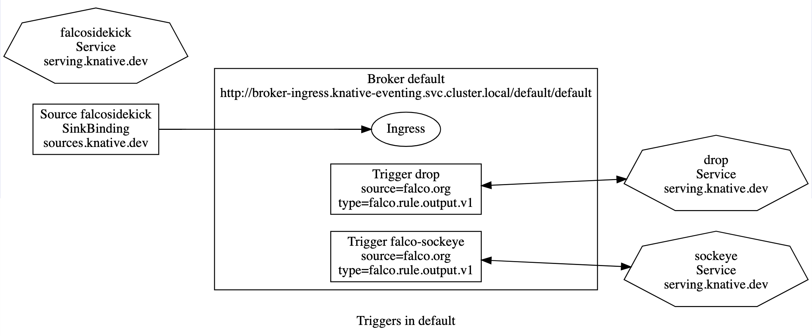
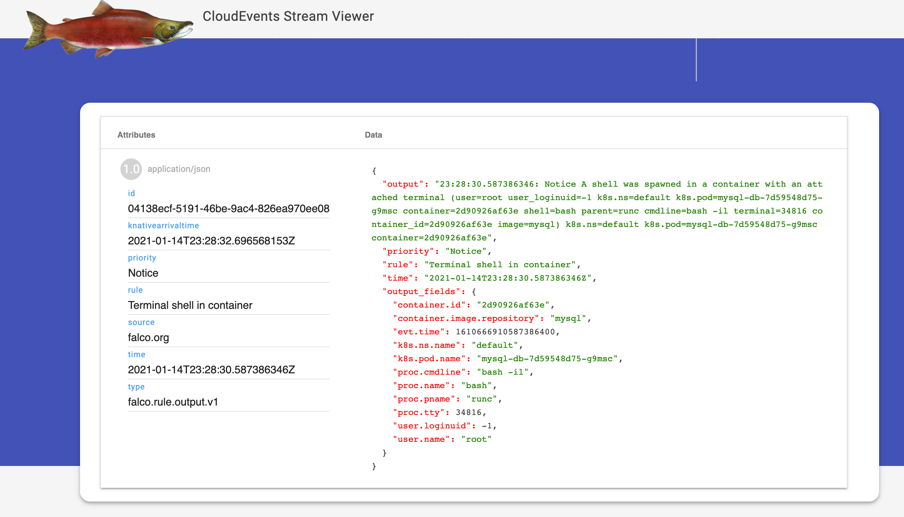

# falco-drop

## Setup

1. Install [Knative Serving and Eventing](https://knative.dev).
1. Install This repo:
     ```
    kubectl apply -f https://github.com/n3wscott/falco-drop/releases/download/v0.0.2/release.yaml
    ```
    > Note: This release contains [Falco Sidekick](https://github.com/falcosecurity/falcosidekick), deployed as a Knative Service.
1. Install [Falco](https://falco.org/).
    > Note: Falco needs to be configured to send to Falco Sidekick. `kubectl get ksvc falcosidekick` for the url.
1. Optionally, install [Sockeye](https://github.com/n3wscott/sockeye).
1. Optionally, install [Graph](https://github.com/n3wscott/graph).

After this is all installed, you will have an eventing topology like this:



## Demo

1. Install a mysql pod:
    ```
    helm install mysql-db stable/mysql
    ```

1. Go try to do bad things on that pod:
   ```
   kubectl exec -it $(kubectl get pods --selector="app=mysql-db" --output=jsonpath={.items..metadata.name}) -- bash -il
   ```

### Expected Results

1. Falco detects root shell creation:

    > falco-969dv falco {"output":"23:48:20.851908334: Notice A shell was spawned in a container with an attached terminal (user=root user_loginuid=-1 k8s.ns=default k8s.pod=mysql-db-7d59548d75-wh44s container=f29b261f8831 shell=bash parent=runc cmdline=bash -il terminal=34816 container_id=f29b261f8831 image=mysql) k8s.ns=default k8s.pod=mysql-db-7d59548d75-wh44s container=f29b261f8831","priority":"Notice","rule":"Terminal shell in container","time":"2021-01-11T23:48:20.851908334Z", "output_fields": {"container.id":"f29b261f8831","container.image.repository":"mysql","evt.time":1610408900851908334,"k8s.ns.name":"default","k8s.pod.name":"mysql-db-7d59548d75-wh44s","proc.cmdline":"bash -il","proc.name":"bash","proc.pname":"runc","proc.tty":34816,"user.loginuid":-1,"user.name":"root"}}

1. Falco Sidekick produces a CloudEvent:

    ```
    Context Attributes,
      specversion: 1.0
      type: falco.rule.output.v1
      source: falco.org
      id: f7628198-3822-4c98-ac3f-71770e272a16
      time: 2021-01-11T23:46:19.82302759Z
      datacontenttype: application/json
    Extensions,
      foo: bar
      priority: Notice
      rule: Terminal shell in container
    Data,
      {
        "output": "23:46:19.823027590: Notice A shell was spawned in a container with an attached terminal (user=root user_loginuid=-1 k8s.ns=default k8s.pod=mysql-db-7d59548d75-wh44s container=f29b261f8831 shell=bash parent=runc cmdline=bash -il terminal=34816 container_id=f29b261f8831 image=mysql) k8s.ns=default k8s.pod=mysql-db-7d59548d75-wh44s container=f29b261f8831",
        "priority": "Notice",
        "rule": "Terminal shell in container",
        "time": "2021-01-11T23:46:19.82302759Z",
        "output_fields": {
          "container.id": "f29b261f8831",
          "container.image.repository": "mysql",
          "evt.time": 1610408779823027700,
          "k8s.ns.name": "default",
          "k8s.pod.name": "mysql-db-7d59548d75-wh44s",
          "proc.cmdline": "bash -il",
          "proc.name": "bash",
          "proc.pname": "runc",
          "proc.tty": 34816,
          "user.loginuid": -1,
          "user.name": "root"
        }
      }
    ```
   
   And sends this to the Knative Eventing Broker "default".

1. The Knative Eventing Broker delivers the CloudEvent to all matching triggers, in our case two:

- The `drop` service filters events and for the Rule `Terminal shell in container`, deletes the pod:
  > [Terminal shell in container] deleted mysql-db-7d59548d75-wh44s from default because 23:48:20.851908334: Notice A shell was spawned in a container with an attached terminal (user=root user_loginuid=-1 k8s.ns=default k8s.pod=mysql-db-7d59548d75-wh44s container=f29b261f8831 shell=bash parent=runc cmdline=bash -il terminal=34816 container_id=f29b261f8831 image=mysql) k8s.ns=default k8s.pod=mysql-db-7d59548d75-wh44s container=f29b261f8831
     
  And this knocks the shell off the deleted pod:
     
  ```
  (╯°□°)╯︵     kubectl exec -it $(kubectl get pods --selector="app=mysql-db" --output=jsonpath={.items..metadata.name}) -- bash -il
  root@mysql-db-7d59548d75-89v4c:/# command terminated with exit code 137
  ```
- `Sockeye` also recieves the event and displays it:
  
